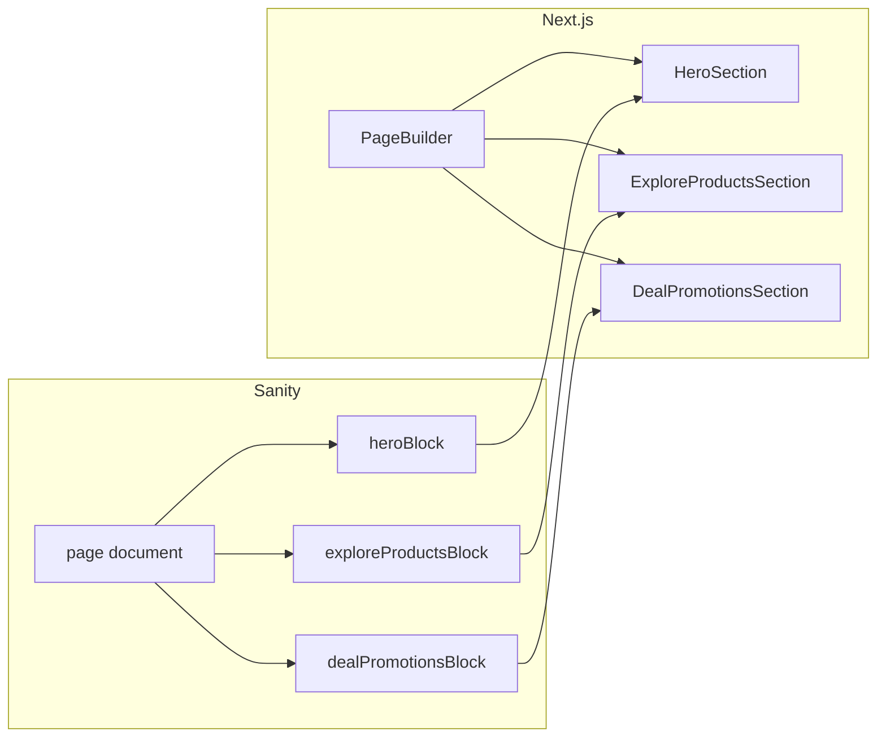
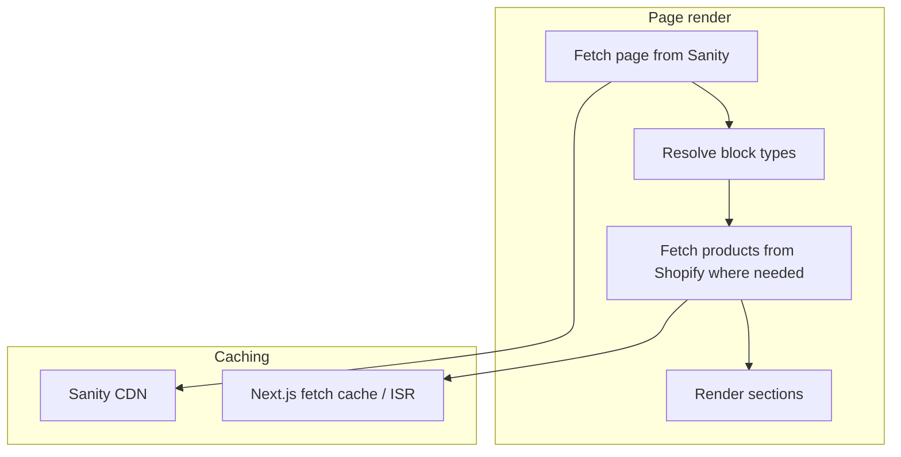

# Headless Shopify + Sanity CMS Architecture Plan

## Overview

Evolve the existing Next.js + Shopify store into a headless architecture with Sanity CMS for fully customizable homepage and content, retaining Shopify for commerce.

---

## Current State Summary

- Next.js 16 (App Router), Tailwind, TypeScript
- Shopify Storefront API client in [lib/shopify.ts](../lib/shopify.ts)
- Cart API routes ([app/api/cart/](../app/api/cart/))
- Product pages at `/products/[handle]`
- Hardcoded homepage sections in [app/page.tsx](../app/page.tsx)

**Goal**: Move homepage layout and content into Sanity so editors can reorder sections, spotlight different products, and change copy without code changes—while keeping Shopify as the source of truth for products, cart, and checkout.

---

## 1. Recommended Folder Architecture

```
shopify-store/
├── sanity/
│   ├── schema/
│   │   ├── index.ts
│   │   ├── documents/
│   │   │   ├── page.ts
│   │   │   └── siteSettings.ts
│   │   ├── objects/
│   │   │   ├── seo.ts
│   │   │   ├── productReference.ts
│   │   │   ├── collectionReference.ts
│   │   │   └── cta.ts
│   │   └── blocks/
│   │       ├── hero.ts
│   │       ├── exploreProducts.ts
│   │       ├── ourStory.ts
│   │       ├── dealPromotions.ts
│   │       ├── reviews.ts
│   │       ├── recipes.ts
│   │       ├── docksideMarkets.ts
│   │       ├── upcomingEvents.ts
│   │       ├── localFoodsCoops.ts
│   │       ├── faq.ts
│   │       ├── saleBanner.ts          # Optional
│   │       ├── newsletter.ts          # Optional
│   │       └── index.ts
│   ├── sanity.config.ts
│   └── sanity.cli.ts
├── app/
│   ├── (shop)/
│   │   ├── page.tsx
│   │   ├── products/[handle]/
│   │   ├── collections/[handle]/
│   │   └── cart/
│   ├── studio/[[...tool]]/page.tsx
│   └── api/
│       ├── cart/
│       └── revalidate/
├── components/
│   ├── sections/
│   │   ├── HeroSection.tsx
│   │   ├── ExploreProductsSection.tsx
│   │   ├── OurStorySection.tsx
│   │   ├── DealPromotionsSection.tsx
│   │   ├── ReviewsSection.tsx
│   │   ├── RecipesSection.tsx
│   │   ├── DocksideMarketsSection.tsx
│   │   ├── UpcomingEventsSection.tsx
│   │   ├── LocalFoodsCoopsSection.tsx
│   │   ├── FaqSection.tsx
│   │   └── PageBuilder.tsx
│   ├── layout/
│   └── product/
├── lib/
│   ├── shopify.ts
│   ├── sanity.ts
│   └── graphql/
└── types/
```

---

## 2. Sanity Schema (Figma-Aligned)

Schema derived from [Hook Point Website Final For Feedback](https://www.figma.com/design/BmnL3hmZnAaZOHmXlYe9K3/).

### Document: `page`

```ts
{
  name: 'page',
  type: 'document',
  fields: [
    { name: 'title', type: 'string' },
    { name: 'slug', type: 'slug', options: { source: 'title' } },
    {
      name: 'sections',
      type: 'array',
      of: [
        { type: 'heroBlock' },
        { type: 'exploreProductsBlock' },
        { type: 'ourStoryBlock' },
        { type: 'dealPromotionsBlock' },
        { type: 'reviewsBlock' },
        { type: 'recipesBlock' },
        { type: 'docksideMarketsBlock' },
        { type: 'upcomingEventsBlock' },
        { type: 'localFoodsCoopsBlock' },
        { type: 'faqBlock' },
        { type: 'saleBannerBlock' },    // Optional
        { type: 'newsletterBlock' },    // Optional
      ],
    },
  ],
}
```

### Document: `siteSettings` (singleton, global)

- **Header**: Top bar (SHOP link + icons), main nav (Shop, Our Story, Recipes, Calendar, Contact), promo banner ("Subscribe & Save 10%")
- **Footer**: Logo, org member logos, newsletter (email + zip fields), nav links

### Block Types (Figma Section Order)

| Order | Section | Block Type | Key Fields |
|-------|---------|------------|------------|
| 1 | Hero | `heroBlock` | headline, subline, cta, images (array), carousel |
| 2 | Explore Our Products | `exploreProductsBlock` | title, description, categories (array: { label, collectionHandle, image }) |
| 3 | Our Story | `ourStoryBlock` | title, body (portable text), image, subheading ("Why Wild Matters"), cta |
| 4 | Deal & Promotions | `dealPromotionsBlock` | title, description, productRefs (handles), layout (grid) |
| 5 | Reviews | `reviewsBlock` | title, description, reviews (array: { stars, text, name, date }) |
| 6 | Recipes | `recipesBlock` | title, description, recipes (array: { title, image, url }), showMoreUrl |
| 7 | Dockside and Farmers Markets | `docksideMarketsBlock` | title, description, items (array: { label, logo?, url? }) |
| 8 | Upcoming Events | `upcomingEventsBlock` | title, description, events (array: { date, time, name, location }), showAllUrl |
| 9 | Local Foods Co-ops | `localFoodsCoopsBlock` | title, body, image, logoButtons (array) |
| 10 | FAQ | `faqBlock` | title, description, faqs (array: { question, answer }), showMoreUrl |

### Objects

**productReference**: `{ shopifyHandle: string }`  
**collectionReference**: `{ collectionHandle: string }`  
**seo**: `{ title: string, description: text, image: image }`  
**cta**: `{ label: string, href: string }`

Store only identifiers (handle/GID) in Sanity. Product data is always fetched from Shopify at render time.

---

## 3. Other Pages: Now vs Later

### Phase 1 (Now)

- Homepage (fully Sanity-driven)
- Global layout (header, footer, siteSettings)
- Product detail and collection pages (keep existing Shopify-driven structure)

### Phase 2 (Later)

| Page | Sanity Role | Priority |
|------|-------------|----------|
| Recipes | Full Sanity page (recipe list + detail) | High |
| Calendar / Events | Full Sanity page or `eventsBlock` data | High |
| Our Story | Full Sanity page (long-form content) | Medium |
| Product detail | SEO metadata, optional rich content blocks | Medium |
| Collection | Collection-level banner, description | Medium |
| FAQ | Full Sanity page or reuse `faqBlock` | Low |
| Cart / Checkout | No Sanity – Shopify only | N/A |

Add Phase 2 when you need dedicated URLs and more content.

---

## 4. Component Architecture

### Block-to-Component Mapping



### PageBuilder

```tsx
switch (block._type) {
  case 'heroBlock': return <HeroSection key={block._key} {...block} />;
  case 'exploreProductsBlock': return <ExploreProductsSection key={block._key} {...block} />;
  case 'ourStoryBlock': return <OurStorySection key={block._key} {...block} />;
  case 'dealPromotionsBlock': return <DealPromotionsSection key={block._key} {...block} />;
  case 'reviewsBlock': return <ReviewsSection key={block._key} {...block} />;
  case 'recipesBlock': return <RecipesSection key={block._key} {...block} />;
  case 'docksideMarketsBlock': return <DocksideMarketsSection key={block._key} {...block} />;
  case 'upcomingEventsBlock': return <UpcomingEventsSection key={block._key} {...block} />;
  case 'localFoodsCoopsBlock': return <LocalFoodsCoopsSection key={block._key} {...block} />;
  case 'faqBlock': return <FaqSection key={block._key} {...block} />;
  // ... saleBannerBlock, newsletterBlock
}
```

### Section Components

- **HeroSection**: Headline, subline, CTA, image carousel. Images from Sanity.
- **ExploreProductsSection**: Category links → Shopify collection URLs.
- **OurStorySection**: Portable text + image. Sanity only.
- **DealPromotionsSection**: Resolves productRefs → fetches from Shopify → product cards.
- **ReviewsSection**, **RecipesSection**, **DocksideMarketsSection**, **UpcomingEventsSection**, **LocalFoodsCoopsSection**, **FaqSection**: Sanity data only (no Shopify).

---

## 5. Data Fetching Strategy



- **Sanity**: GROQ, `next: { revalidate: 60 }`, on-demand revalidation via webhook.
- **Shopify**: Product/collection with `revalidate: 60`; cart mutations uncached.
- **Revalidation**: Sanity webhook → `POST /api/revalidate?secret=...` → `revalidatePath('/')`.

### Example GROQ Query

```groq
*[_type == "page" && slug.current == "home"][0] {
  title,
  sections[] {
    _type,
    _key,
    ...
  }
}
```

---

## 6. Best Practices

| Concern | Approach |
|---------|----------|
| Single source of truth | Products, pricing, inventory = Shopify. Presentation, order = Sanity. |
| Product references | Store handle or GID in Sanity. Never duplicate product data. |
| Broken references | Handle missing products gracefully (hide or placeholder). |
| Images | Hero/gallery = Sanity. Product images = always Shopify CDN. |
| Cart/checkout | 100% Shopify. No Sanity involvement. |

---

## 7. Deployment

- **Vercel**: Add env vars:
  - `NEXT_PUBLIC_SANITY_PROJECT_ID` – Sanity project ID
  - `NEXT_PUBLIC_SANITY_DATASET` – Sanity dataset (e.g. `production`)
  - `SANITY_REVALIDATE_SECRET` – Secret for revalidation webhook (optional)
  - Plus existing Shopify vars.
- **Sanity Studio**: Embedded at `/studio` or deploy separately.
- **Webhooks**: Sanity → revalidate endpoint. Optional Shopify inventory webhooks.

---

## 8. Migration Path

1. Initialize Sanity, add schemas.
2. Create `lib/sanity.ts` and homepage query.
3. Build PageBuilder and section components.
4. Create "home" document in Sanity Studio.
5. Update `app/page.tsx` to fetch from Sanity and render PageBuilder.
6. Wire revalidation webhook.
7. Phase 2: Add Recipe, Events, Our Story pages as needed.

---

## 9. Scalability

- **Frequent product changes**: Editors update refs in Sanity; no deploy. Product data from Shopify.
- **Seasonal content**: Add/remove sections, reorder, or create new page variants.
- **New sections**: New block type = new schema + new component + one case in PageBuilder.
